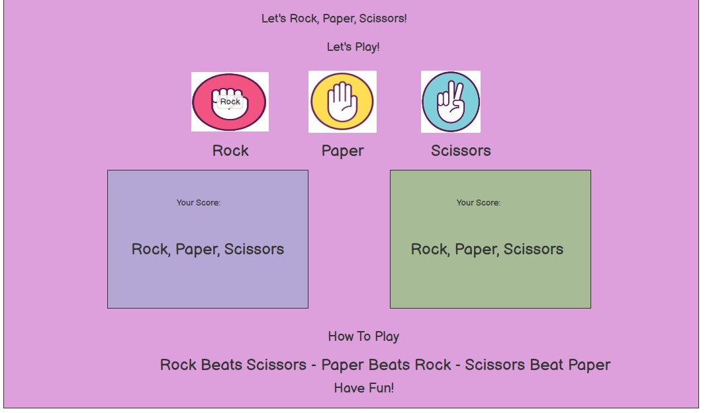

# Let's Rock, Pape, Scissors!

Introduction: 
This is a fun, basic website which provides a game of rock, paper, scissors. 
The user will be provided with an easy to play game against player (user) and the computer. 
The HTML and CSS code will allow for friendly/easy to use navigation with a simple header, divs, images and footer. 
It is intended primarily for anyone who wants to pass time with a simple, easy to use game and/or for children that are developing their thinking/visual skills. 

I hope to accomplish a friendly and easy to navigate website for user expereince, accessibility and responsivity.  

# Content: 
Introduction 
Strategy
Scope & Structure
Skeleton/Wireframes/Surface
Design & Features
Testing
HTML/CSS/Javascript Validators
Fixed Bugs
Deployment
Credits


# Strategy: 
If I'm honest, this module on Javascript has been challenging so the strategy for this project was to keep it as simple as possible. 
The aim of the game is is to beat the computer against a simple Rock, Paper, Scissors challenge. 

# Scope: 

- Responsivity over 3 screen sizes - laptops (over 1000xp), tablets (768px width) and mobile devide (320px mas width). The three sizes will provide all the same buttons, graphics and results/score keeping.

- Navigation is very easy to understand and utilise. The hover button has also been included as an extra feature. This works well on the laptop and tablet screens but is a little slow on the mobile device. 

- Calming & pleasant foreground and background colours to provide an enjoyable experience. 

# Structure: 
- all features will be on one page - including the game options and and result pop up screen. Score keeping will also be included showing whether the computer wins, the user or if it's a tie. (In this case, the score will not be incremented). 

- The pop up screen will show one of three messages: 
1) A congratulatory message confirming you won, a sorry message to say the computer won or to confirm it was a tie. 

# Skeleton: 
Balsamiq was sued when creating the wireframes for the laptop, tablet and mobile. 

```md

```


